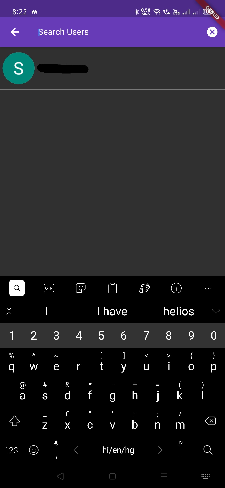
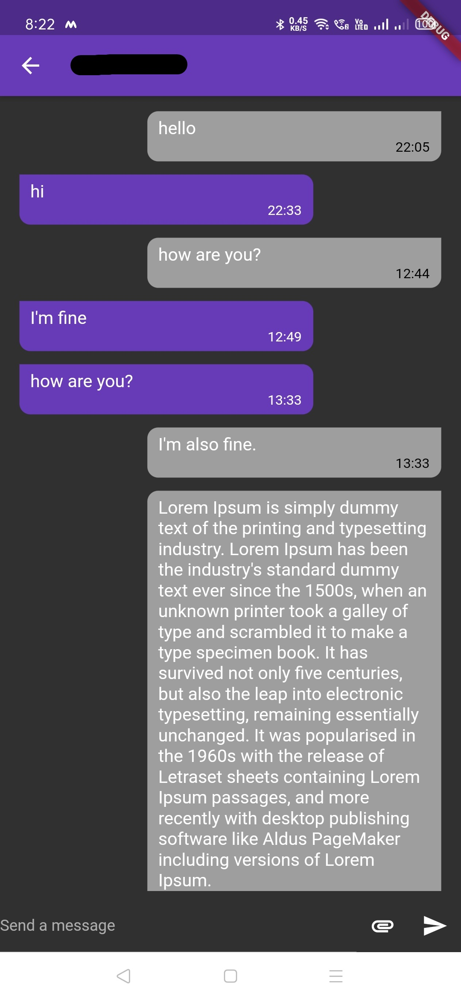
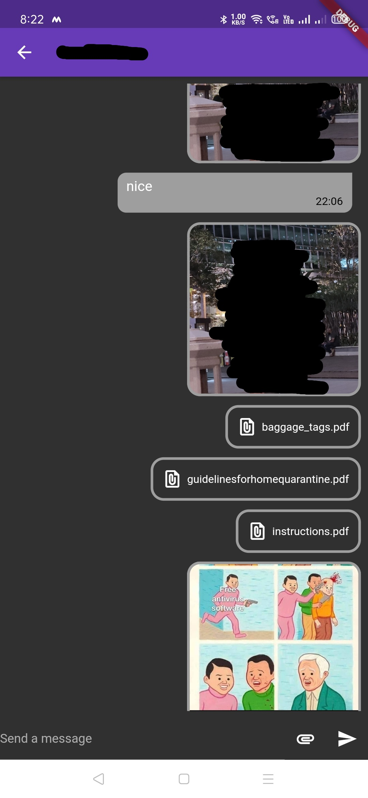

# Chat App

A chat application built using Flutter.

## Features
- Google Sign In
- Send text, image and document
- Search users

## Technologies Used
- Flutter
- Firebase 
- Cloud Firestore

## Screenshots
    
